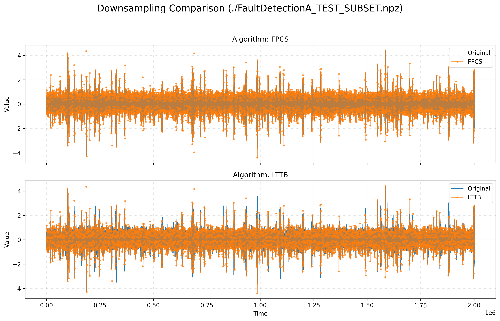

# FPCS - Feature-Preserving Compensated Sampling

[](https://opensource.org/licenses/MIT)

**FPCS** is a high-performance time series downsampling algorithm designed to
preserve critical visual features (peaks and valleys) while significantly
reducing data size. It is particularly well-suited for real-time visualization
and streaming data applications.

Implementation based on the [Feature-Preserving Compensated Sampling for Time
Series Visualization](https://ieeexplore.ieee.org/document/10669793)
publication.

---

## Why FPCS?

Unlike simple decimation or even some advanced algorithms like LTTB, FPCS
retains the min/max within each sampling window, helping preserve prominent
peaks and valleys while allowing smaller local extrema to be dropped.

### Visual Comparison (FPCS vs LTTB)
FPCS maintains the full range of the signal even at high downsampling ratios,
whereas LTTB may miss sharp spikes in noisy datasets.



### Key Features
- **High Performance:** Cython-optimized core is competitive with optimized LTTB
  (see benchmarks below).
- **Streaming data:** Supports incremental processing via `FPCSDownsampler`.
- **Feature preserving:** Guarantees retention of min/max points within each
  window.
- **Robust:** Native handling of `NaN` and `Inf` values.
- **Batched processing:** Efficiently downsample multiple series at once.

---

## Installation

```bash
# Install from PyPI
pip install fpcs
```

**Requirements**
- Python >= 3.11
- NumPy

**Optional (for the Cython extension)**
- C compiler and Python headers
- Cython (the package falls back to the pure Python backend if Cython isn't
  available)

```bash
# Install from source (local checkout)
pip install .

# For development (includes Cython, pytest, benchmarks)
pip install -e ".[dev]"
```

---

## Usage

### Batch Downsampling
Processing existing datasets:
```python
import numpy as np
from fpcs import downsample

# Generate 1M points
x = np.arange(1_000_000, dtype=np.float64)
y = np.sin(x * 0.01) + np.random.randn(1_000_000) * 0.5

# Downsample by a factor of 100
x_ds, y_ds = downsample(x, y, ratio=100)

print(f"Original: {len(x)} points | Downsampled: {len(x_ds)} points")
```

### Streaming data
Processing data in real-time:
```python
from fpcs import FPCSDownsampler

downsampler = FPCSDownsampler(ratio=10)

# Simulate a stream
for xi, yi in zip(stream_x, stream_y):
    # .add() yields retained points immediately
    for rx, ry in downsampler.add(xi, yi):
        update_plot(rx, ry)

# Flush any remaining points at the end of the stream
for rx, ry in downsampler.flush():
    update_plot(rx, ry)
```

## API Reference

### `downsample(x, y, ratio)`
The main entry point for batch processing.
- **Parameters:**
    - `x` (Array-like): The x-coordinates (e.g., timestamps).
    - `y` (Array-like): The y-coordinates.
    - `ratio` (int): The sampling window size (R). Must be >= 1.
- **Returns:**
    - `(np.ndarray, np.ndarray)`: A tuple of `(x_downsampled, y_downsampled)`.
 - **Notes:**
    - The first and last input points are always retained in batch mode.
    - `NaN` values are always retained to preserve gaps.
    - `±Inf` values are treated as extrema.
    - Integer inputs are supported; the Cython backend converts them to float64.

### `FPCSDownsampler`
Class for streaming/incremental downsampling.

#### `__init__(ratio: int)`
Initialize the downsampler.
- `ratio`: Sampling window size. Must be >= 1.

#### `add(x: float, y: float) -> Iterator[tuple[float, float]]`
Add a single point to the downsampler.
- **Yields:** Tuples of `(x, y)` for any points retained during this step.
 - **Notes:**
    - Streaming mode does **not** auto-include the first/last points; if you
      need them, add them yourself.
    - `NaN` values are always retained and `±Inf` values are treated as extrema.

#### `flush() -> Iterator[tuple[float, float]]`
Flush any remaining points from the internal buffer (e.g., at the end of a
stream).
- **Yields:** Tuples of `(x, y)` for remaining points.

#### `reset()`
Resets the downsampler state to initial conditions.

### Advanced / Optimization API
These functions are available when the Cython extension is successfully
compiled. You can check the active backend with `get_backend()`.

#### `downsample_into(x, y, ratio, out_x, out_y) -> int`
Downsample into pre-allocated output buffers to reduce memory allocation
overhead.
- **Parameters:**
    - `x`, `y`: Input arrays (integer inputs are supported and converted to float64).
    - `out_x`, `out_y`: Output buffers (contiguous float64, must be large enough).
- **Returns:** Number of points written.
 - **Notes:** Recommended output buffer size is `((len(x) + ratio - 1) // ratio)
   * 2 + 2`.

#### `downsample_batch(x_arrays, y_arrays, ratio) -> List[tuple]`
Efficiently process a list of time series. Reduces Python overhead compared to a
loop.

### Backend Availability
- `downsample` and `FPCSDownsampler` are always available.
- `downsample_into` and `downsample_batch` are only available with the Cython
  backend (they are `None` when using pure Python).
- Use `get_backend()` to check which backend is active (`"cython"` or
  `"python"`).

---

## Performance
Comparison between FPCS (Python/Cython) and a C implementation of the LTTB
algorithm.

**Algorithm comparison**

| Name (time in ms) | Min | Max | Mean | StdDev | OPS |
|:---|---:|---:|---:|---:|---:|
| **Cython FPCS** | 1.2370 | 1.3534 | 1.2546 | 0.0162 | 797.0606 |
| **LTTB (C impl)** | 2.5252 | 2.6372 | 2.5394 | 0.0166 | 393.7865 |
| **Pure Python** | 393.6482 | 398.6493 | 395.6410 | 2.3321 | 2.5275 |

**Ratio scaling (Cython)**

| Ratio | Mean Time (ms) | StdDev |
|:---|---:|---:|
| **10** | 4.05 | 0.81 |
| **50** | 3.86 | 0.89 |
| **100** | 4.02 | 0.90 |
| **500** | 4.32 | 0.74 |

## License
This project is licensed under the MIT Licence - see the LICENSE file for details.
